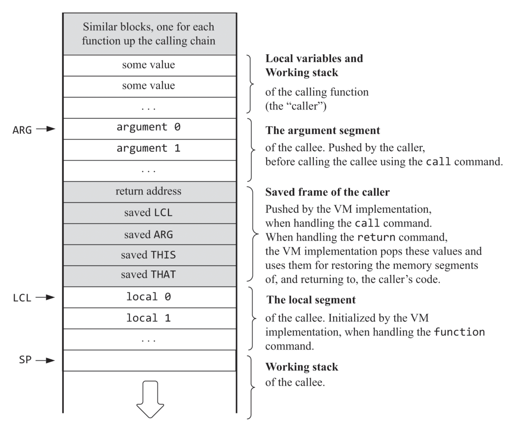

# vm-translator

A VM translator for the Hack virtual machine written in Python, built as part of the [Nand2Tetris](https://www.nand2tetris.org/) course (Projects 7 & 8).

Translates `.vm` files written in the Hack VM language into `.asm` Hack assembly files. Supports both single-file and multi-file (directory) translation.

For a detailed overview of the entire computing system and compilation process, [click here](https://github.com/j0klar/jack-compiler).


## Usage

```bash
python translator.py <file.vm>        # single file
python translator.py <directory>      # directory of .vm files
```

The output `.asm` file will be created in the same directory as the input.


## Examples

```bash
python translator.py Main.vm            # produces Main.asm
python translator.py Pong/              # produces Pong.asm
```

The `Pong/` folder contains `.vm` files for a simple pong game and the [Jack OS](https://github.com/j0klar/jack-os), serving as an example to demonstrate the compilation pipeline described [here](https://github.com/j0klar/jack-compiler).


## Supported Commands

**Memory access:** `push`, `pop` - segments: `constant`, `local`, `argument`, `this`, `that`, `temp`, `pointer`, `static`

**Arithmetic-logical:** `add`, `sub`, `neg`, `eq`, `gt`, `lt`, `and`, `or`, `not`

**Branching:** `label`, `goto`, `if-goto`

**Functions:** `function`, `call`, `return`


## The Global Stack



*Source: Nisan & Schocken, The Elements of Computing Systems, 2nd ed. MIT Press (2021), Figure 8.3.*


## Project Structure

```
vm-translator/
├── translator.py     # Main entry point
├── code_writer.py    # Translates VM commands to Hack assembly
├── parser.py         # Parses .vm files into commands
├── global-stack.png  # Global stack diagram
└── Pong/
        
```